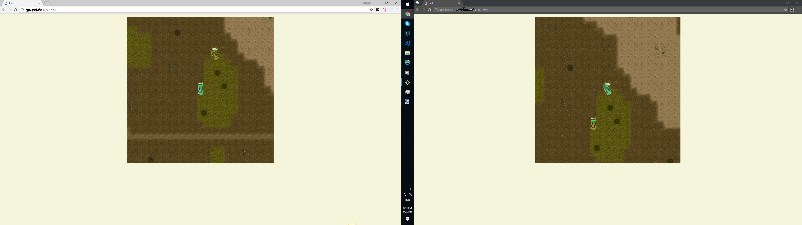

# battle-tanks

mini multiply game

Run

install and run mondoDB

npm i
npm run server-run

on other shell
npm run client-watch

note change domian in cleint from "192.168.0.197" to your in game/reduser/index.js and main.js
after move to your browser by url like "192.168.0.197:8000"

then signin and play ))

